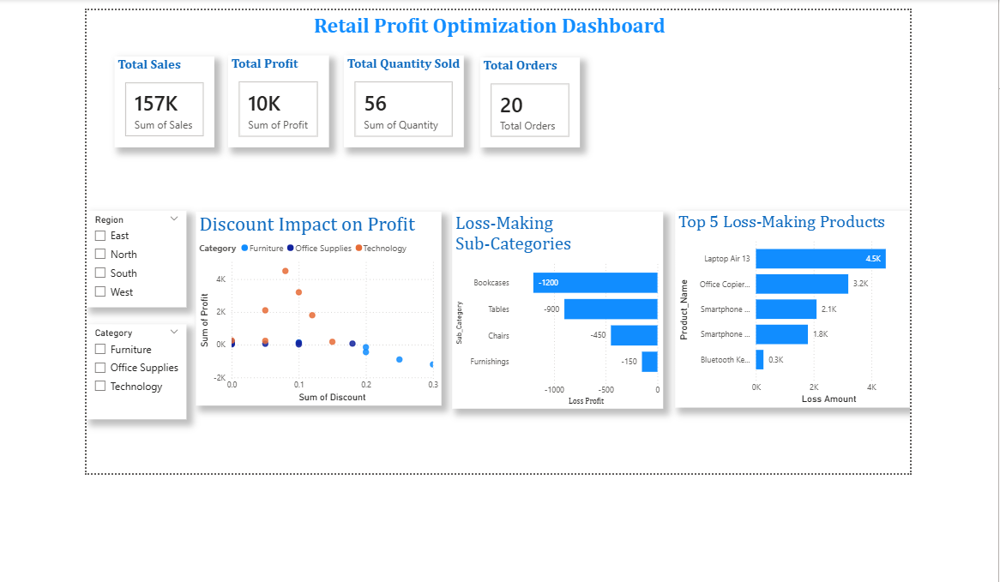

# Retail Profit Optimization Dashboard 

##  Project Overview
This is a Power BI dashboard project created to analyze retail sales data and identify profit improvement opportunities.

The dashboard highlights:
- Total Sales
- Total Profit
- Total Quantity Sold
- Total Orders
- Discount Impact on Profit
- Loss-Making Sub-Categories
- Top 5 Loss-Making Products

##  Dashboard Preview

## Tools Used
- Power BI Desktop
- Python (ETL / Cleaning)
- SQL (Analysis Queries)
- Git & GitHub

##  Project Folder Structure
- `data/` → raw and cleaned datasets  
- `powerbi/` → Power BI (.pbix) file  
- `python/` → ETL and cleaning scripts  
- `sql/` → SQL analysis queries  
- `screenshots/` → dashboard screenshot  

##  How to Use
1. Open `powerbi/Retail_Profit_Optimization_Dashboard.pbix` in Power BI Desktop
2. Explore visuals and filters (Region, Category)
3. Check cleaned data inside `data/`
4. View SQL queries in `sql/analysis_queries.sql`

##  Author
Sameera Gundlur Shaik
